# The Sodium figures, recreated

All twenty transaction-axis figures of the Sodium FRP book — *Functional
Reactive Programming*, Stephen Blackheath and Anthony Jones (Manning, 2016) —
rebuilt as Swirly grid-mode specifications. This is the acceptance test for grid
mode: if a figure here cannot be expressed, grid mode is missing something.

The book's figures are not reproduced here, so comparing a recreation against
its original means having the book to hand. Each was measured off the original
rather than eyeballed, so column counts, divider positions and early box
closures line up.

Recreations are rendered with [`@swirly/theme-sodium`](../packages/swirly-theme-sodium),
which matches the book's line art — black on white, no fills, everything italic,
and columns sized to what they hold.

One systematic difference is deliberate: the book **left-aligns each column
label** just past the boundary that opens it, where Swirly centres it in the
column.

Boundaries now match one-for-one. Swirly draws exactly one dashed line per
column declared in the source and none after the last, which is how fifteen of
these twenty figures are drawn. The other five -- 4, 5, 6, 7 and 12 -- do close
their last column, and say so with a trailing unlabelled column: one `|` per
column, with the last carrying no label.

```text
@ t | 0 | 1 |
```

Regenerate with:

```bash
yarn build && node scripts/build-sodium-figures.js
```


[1](#figure-1) · [2](#figure-2) · [3](#figure-3) · [4](#figure-4) · [5](#figure-5) · [6](#figure-6) · [7](#figure-7) · [8](#figure-8) · [9](#figure-9) · [10](#figure-10) · [11](#figure-11) · [12](#figure-12) · [13](#figure-13) · [14](#figure-14) · [15](#figure-15) · [16](#figure-16) · [17](#figure-17) · [18](#figure-18) · [19](#figure-19) · [20](#figure-20)

## Figure 1

The bare apparatus: a transaction axis labelled `t`, one dashed boundary opening each transaction, and a stream `s` that never fires. Sodium streams do not complete, so the line simply runs off the right.

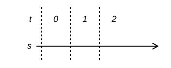

```
@ t | 0 | 1 | 2

> s |  |  |
```

## Figure 2

Two streams firing in every transaction. Values sit on the line rather than inside a marble, and rows share one axis, so what happens simultaneously lines up vertically.

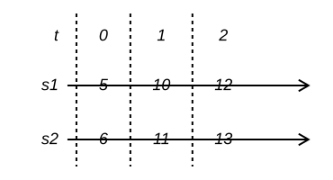

```
@ t | 0 | 1 | 2

> s1 | 5 | 10 | 12

> s2 | 6 | 11 | 13
```

## Figure 3

A cell and two streams over nine transactions. The box holds `3`, then `4` from transaction 2, then `7` from transaction 6, while `s1` and `s2` fire at 0, 3 and 5. Unlike the `hold` figures below, the cell here does not track either stream one transaction behind.

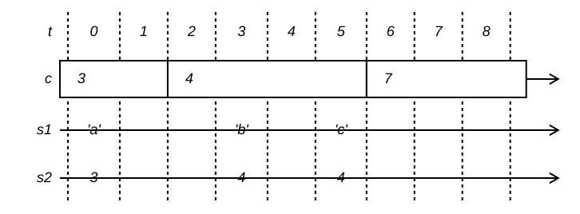

```
@ t | 0 | 1 | 2 | 3 | 4 | 5 | 6 | 7 | 8

=  c | 3   |  | 4   |     |  |     | 7 |  |

> s1 | 'a' |  |     | 'b' |  | 'c' |   |  |

> s2 | 3   |  |     | 4   |  | 4   |   |  |
```

## Figure 4

Three streams, two of them merging into a third. Where both `s1` and `s2` fire in the same transaction — transaction 2 — `s3` carries a single combined value rather than two.

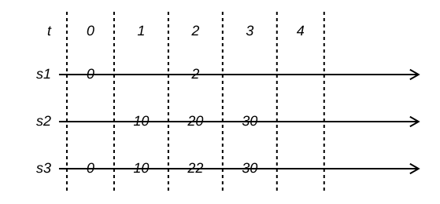

```
@ t | 0 | 1 | 2 | 3 | 4 |

> s1 | 0 |    | 2  |    |  |

> s2 |   | 10 | 20 | 30 |  |

> s3 | 0 | 10 | 22 | 30 |  |
```

## Figure 5

Filtering. `s2` carries only some of `s1`'s values, and a transaction in which nothing passes leaves a blank slot rather than a gap in the line.

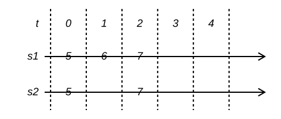

```
@ t | 0 | 1 | 2 | 3 | 4 |

> s1 | 5 | 6 | 7 |  |  |

> s2 | 5 |   | 7 |  |  |
```

## Figure 6

A cell holding streams. The slots of `c` name rows rather than literals, so `c` refers to `s1` and then to `s2`; `s3` is the result of switching on it, taking `s1`'s values and then `s2`'s.

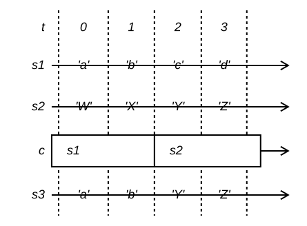

```
@ t | 0 | 1 | 2 | 3 |

> s1 | 'a' | 'b' | 'c' | 'd' |

> s2 | 'W' | 'X' | 'Y' | 'Z' |

=  c | s1  |     | s2  |     |

> s3 | 'a' | 'b' | 'Y' | 'Z' |
```

## Figure 7

A single transaction with multi-token values. A slot is drawn verbatim, so it can hold an expression such as `return 'a'` and not just one character.

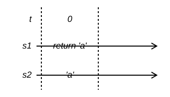

```
@ t | 0 |

> s1 | return 'a' |

> s2 | 'a' |
```

## Figure 8

`hold`: the cell takes each of `s1`'s values one transaction after it fires — `'b'` at 1 becomes the cell's value at 2 — and the box closes at transaction 5 while the line carries on.

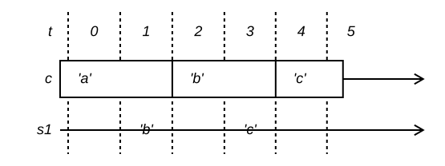

```
@ t | 0 | 1 | 2 | 3 | 4 | 5

=  c | 'a' |     | 'b' |     | 'c' |
to = 5

> s1 |     | 'b' |     | 'c' |     |
```

## Figure 9

The same `hold` with the stream firing in consecutive transactions. The cell still lags by exactly one, and its initial value is already in place before transaction 0.

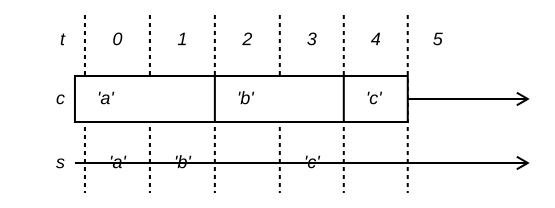

```
@ t | 0 | 1 | 2 | 3 | 4 | 5

= c | 'a' |     | 'b' |     | 'c' |
to = 5

> s | 'a' | 'b' |     | 'c' |     |
```

## Figure 10

`hold` again, with a change in every early transaction: the box is divided at 1, 2 and 4, one step behind the stream's 0, 1 and 3.

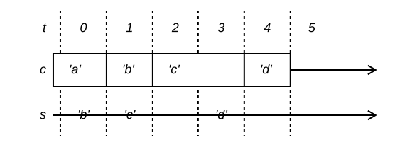

```
@ t | 0 | 1 | 2 | 3 | 4 | 5

= c | 'a' | 'b' | 'c' |     | 'd' |
to = 5

> s | 'b' | 'c' |     | 'd' |     |
```

## Figure 11

Split transactions. A column label can name a nested transaction — `[0,0]` inside `[0]` — and a stream may carry a list of values for the whole outer transaction while another fires once per inner one.

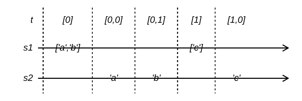

```
@ t | [0] | >[0,0] | >[0,1] | [1] | >[1,0]

> s1 | ['a','b'] |     |     | ['c'] |

> s2 |           | 'a' | 'b' |       | 'c'
```

## Figure 12

A constant cell. One value, no dividers, and the box is already open before transaction 0 and still open after the last.

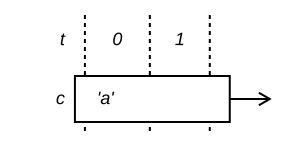

```
@ t | 0 | 1 |

= c | 'a' |  |
```

## Figure 13

A cell changing twice. Each divider marks the transaction in which the held value changes; between dividers the box simply holds.

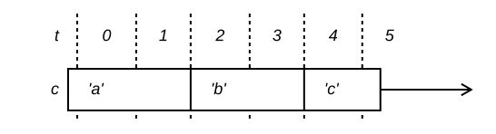

```
@ t | 0 | 1 | 2 | 3 | 4 | 5

= c | 'a' |  | 'b' |  | 'c' |
to = 5
```

## Figure 14

Two cells changing in the same transactions, so their dividers line up. Reading a column downwards gives the state of both cells at that instant.

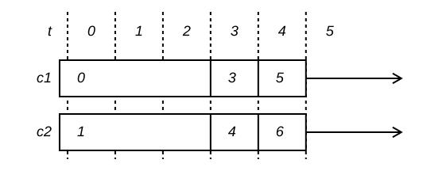

```
@ t | 0 | 1 | 2 | 3 | 4 | 5

= c1 | 0 |  |  | 3 | 5 |
to = 5

= c2 | 1 |  |  | 4 | 6 |
to = 5
```

## Figure 15

A cell of functions applied to a cell of values. `cf` holds `(0+)`, then `(5+)`, then `(6+)`; `cb` is the result, and changes whenever either input does — at 2, 3, 4 and 5 — where `ca` alone changes at 2, 3 and 5.

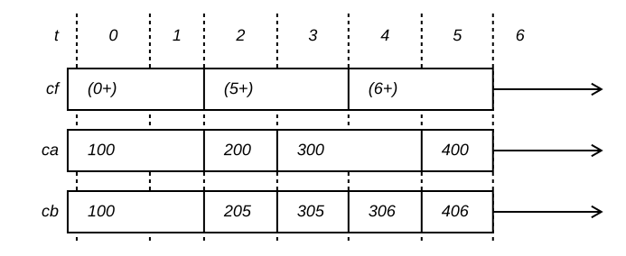

```
@ t | 0 | 1 | 2 | 3 | 4 | 5 | 6

= cf | (0+) |  | (5+) |     | (6+) |     |
to = 6

= ca | 100  |  | 200  | 300 |      | 400 |
to = 6

= cb | 100  |  | 205  | 305 | 306  | 406 |
to = 6
```

## Figure 16

`switch`: `c3` holds a reference to another cell, and `c4` is what comes out — `c1`'s values while `c3` holds `c1`, then `c2`'s from transaction 2.

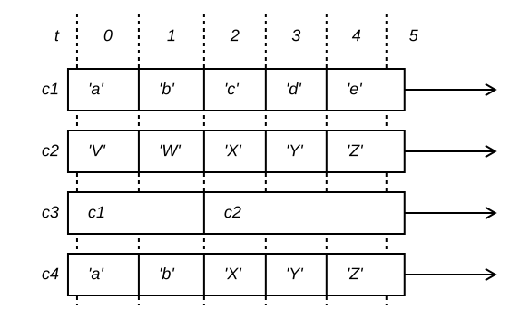

```
@ t | 0 | 1 | 2 | 3 | 4 | 5

= c1 | 'a' | 'b' | 'c' | 'd' | 'e' |
to = 5

= c2 | 'V' | 'W' | 'X' | 'Y' | 'Z' |
to = 5

= c3 | c1  |     | c2  |     |     |
to = 5

= c4 | 'a' | 'b' | 'X' | 'Y' | 'Z' |
to = 5
```

## Figure 17

The same switch with a `c2` that changes less often. `c4` still follows whichever cell `c3` currently names, holding `'X'` across the switch because that is `c2`'s value at the time.

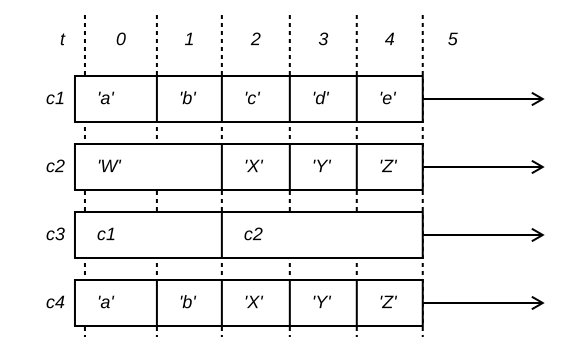

```
@ t | 0 | 1 | 2 | 3 | 4 | 5

= c1 | 'a' | 'b' | 'c' | 'd' | 'e' |
to = 5

= c2 | 'W' |     | 'X' | 'Y' | 'Z' |
to = 5

= c3 | c1  |     | c2  |     |     |
to = 5

= c4 | 'a' | 'b' | 'X' | 'Y' | 'Z' |
to = 5
```

## Figure 18

Switching to a cell that has not changed for a while: `c2` holds `'X'` from before transaction 0 through transaction 2, so `c4` picks up `'X'` at the switch and only moves again at 3.

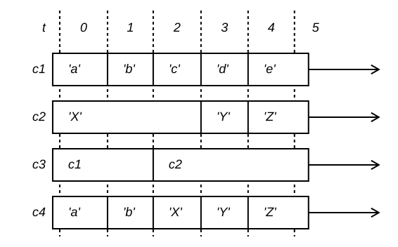

```
@ t | 0 | 1 | 2 | 3 | 4 | 5

= c1 | 'a' | 'b' | 'c' | 'd' | 'e' |
to = 5

= c2 | 'X' |     |     | 'Y' | 'Z' |
to = 5

= c3 | c1  |     | c2  |     |     |
to = 5

= c4 | 'a' | 'b' | 'X' | 'Y' | 'Z' |
to = 5
```

## Figure 19

Switching twice, between three cells. `c4` names `c1`, then `c2` at transaction 2, then `c3` at 4, and `c5` takes its value from whichever is current.

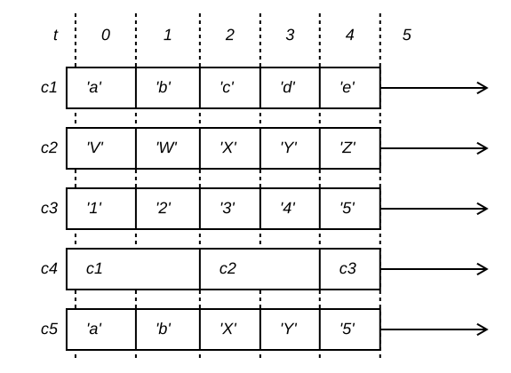

```
@ t | 0 | 1 | 2 | 3 | 4 | 5

= c1 | 'a' | 'b' | 'c' | 'd' | 'e' |
to = 5

= c2 | 'V' | 'W' | 'X' | 'Y' | 'Z' |
to = 5

= c3 | '1' | '2' | '3' | '4' | '5' |
to = 5

= c4 | c1  |     | c2  |     | c3  |
to = 5

= c5 | 'a' | 'b' | 'X' | 'Y' | '5' |
to = 5
```

## Figure 20

Annotation rows. `a1` and `a2` address the same columns as every other row but carry no line — they comment on a transaction rather than being a stream or a cell. The cell `c` stops holding at transaction 3.

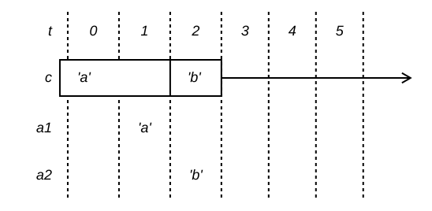

```
@ t | 0 | 1 | 2 | 3 | 4 | 5

=  c | 'a' |     | 'b' |  |  |
to = 3

. a1 |     | 'a' |     |  |  |

. a2 |     |     | 'b' |  |  |
```
