# Examples

[concatAll](#concatall)
·
[debounce](#debounce)
·
[exhaustAll](#exhaustall)
·
[gridAnnotations](#gridannotations)
·
[gridAxis](#gridaxis)
·
[gridCell](#gridcell)
·
[gridHold](#gridhold)
·
[gridNested](#gridnested)
·
[gridStreams](#gridstreams)
·
[gridSwitch](#gridswitch)
·
[onErrorResumeNext](#onerrorresumenext)
·
[pluck](#pluck)
·
[skipUntil](#skipuntil)
·
[zipAll](#zipall)

## concatAll

[Spec](examples/concatAll.txt)
·
[PNG](examples/concatAll.png)
·
[SVG](examples/concatAll.svg)

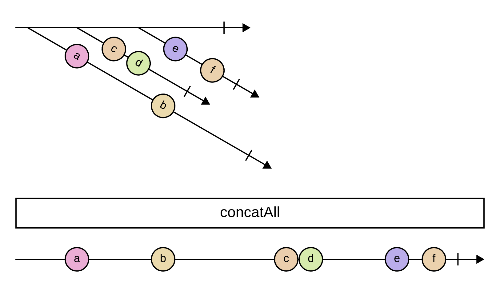

```
% An example application of the concatAll operator.
% Showcases styles and higher-order observables.
% Based on RxJS's concatAll diagram:
% https://github.com/ReactiveX/rxjs/blob/fc3d4264395d88887cae1df2de1b931964f3e684/spec/operators/concatAll-spec.ts

[styles]
frame_width = 20
completion_height = 20
higher_order_angle = 30
arrow_fill_color = black

x = ----a------b------|

y = ---c-d---|

z = ---e--f-|

-x---y----z------|

> concatAll

-----a------b---------c-d------e--f-|
```

## debounce

[Spec](examples/debounce.txt)
·
[PNG](examples/debounce.png)
·
[SVG](examples/debounce.svg)

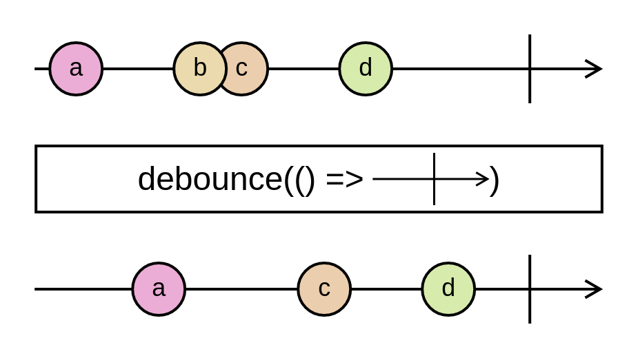

```
% An example application of the debounce operator.
% Showcases marble diagrams inside operators.
% Based on RxJS's debounce diagram:
% https://github.com/ReactiveX/rxjs/blob/fc3d4264395d88887cae1df2de1b931964f3e684/spec/operators/debounce-spec.ts

-a--bc--d---|

> debounce(() => `--|`)

---a---c--d-|
```

## exhaustAll

[Spec](examples/exhaustAll.txt)
·
[PNG](examples/exhaustAll.png)
·
[SVG](examples/exhaustAll.svg)

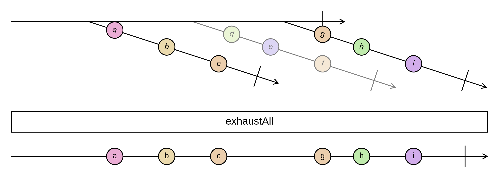

```
% An example application of the exhaustAll operator.
% Showcases ghost notifications.

x = --a---b---c--|

y = ---d--e---f---|

z = ---g--h---i---|

------x-------y------z--|
ghosts = y

> exhaustAll

--------a---b---c-------g--h---i---|
```

## gridAnnotations

[Spec](examples/gridAnnotations.txt)
·
[PNG](examples/gridAnnotations.png)
·
[SVG](examples/gridAnnotations.svg)

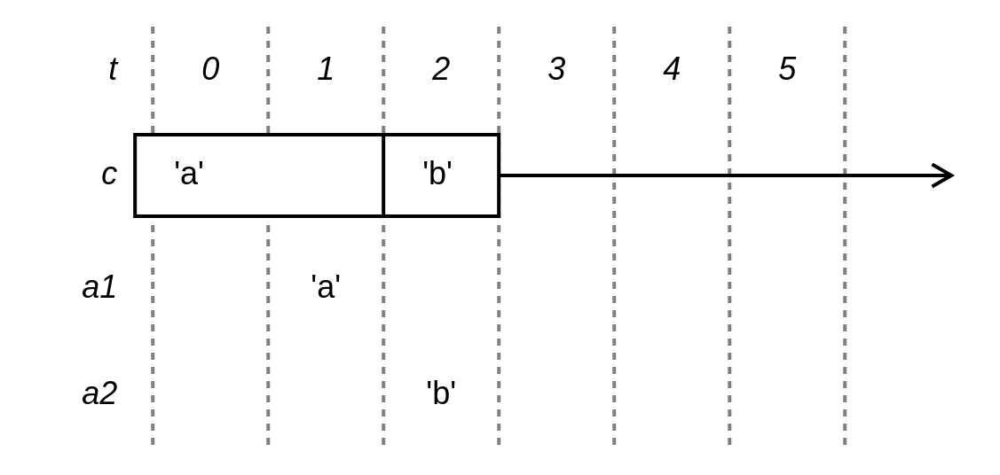

```
% Annotation rows, declared with `.`, address the same columns as every other
% row but draw no line of their own — they comment on a transaction rather than
% carrying a stream or a cell.

@ t | 0 | 1 | 2 | 3 | 4 | 5

= c | 'a' |  | 'b' |  |  |  |
to = 3

. a1 |  | 'a' |  |  |  |  |

. a2 |  |  | 'b' |  |  |  |
```

## gridAxis

[Spec](examples/gridAxis.txt)
·
[PNG](examples/gridAxis.png)
·
[SVG](examples/gridAxis.svg)

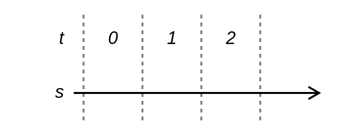

```
% A transaction grid. Grid mode replaces the continuous marble timeline with a
% discrete, labelled axis that every row shares: `@` declares the columns, and
% one dashed boundary opens each of them.
%
% `>` declares a stream row. Its slots are empty here, so the line just runs
% through — Sodium streams never complete, so there is no `|` to write.

@ t | 0 | 1 | 2

> s |  |  |  |
```

## gridCell

[Spec](examples/gridCell.txt)
·
[PNG](examples/gridCell.png)
·
[SVG](examples/gridCell.svg)

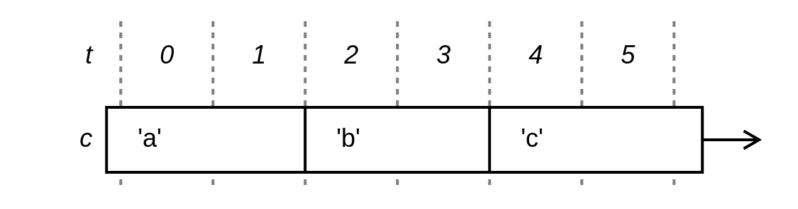

```
% A cell row holds a value across an interval. `=` declares one, and its box is
% divided wherever the held value changes: a non-empty slot opens a new run and
% a blank one extends the run before it, so the dividers are derived rather
% than written out.

@ t | 0 | 1 | 2 | 3 | 4 | 5

= c | 'a' |  | 'b' |  | 'c' |  |
```

## gridHold

[Spec](examples/gridHold.txt)
·
[PNG](examples/gridHold.png)
·
[SVG](examples/gridHold.svg)

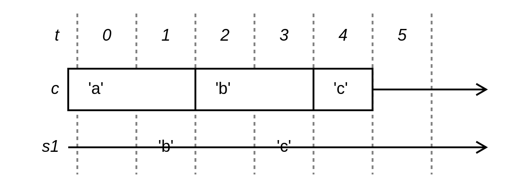

```
% `hold` turns a stream into a cell, one transaction behind: s1 fires 'b' in
% transaction 1 and c starts holding it in transaction 2.
%
% `to` closes the box early, at the boundary that opens the column it names.
% The line carries on to the same arrowhead every other row reaches.

@ t | 0 | 1 | 2 | 3 | 4 | 5

= c | 'a' |  | 'b' |  | 'c' |  |
to = 5

> s1 |  | 'b' |  | 'c' |  |  |
```

## gridNested

[Spec](examples/gridNested.txt)
·
[PNG](examples/gridNested.png)
·
[SVG](examples/gridNested.svg)

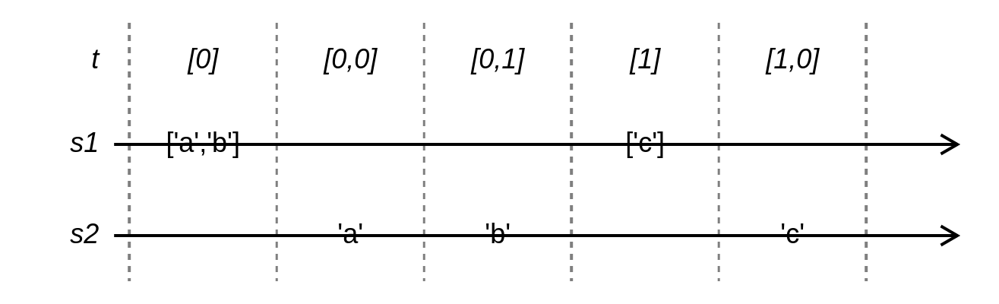

```
% Split transactions. A column label may name a nested transaction, and each
% leading `>` on it marks one more level of nesting, which lightens the grid
% line that opens that column.

@ t | [0] | >[0,0] | >[0,1] | [1] | >[1,0]

> s1 | ['a','b'] |  |  | ['c'] |  |

> s2 |  | 'a' | 'b' |  | 'c' |
```

## gridStreams

[Spec](examples/gridStreams.txt)
·
[PNG](examples/gridStreams.png)
·
[SVG](examples/gridStreams.svg)

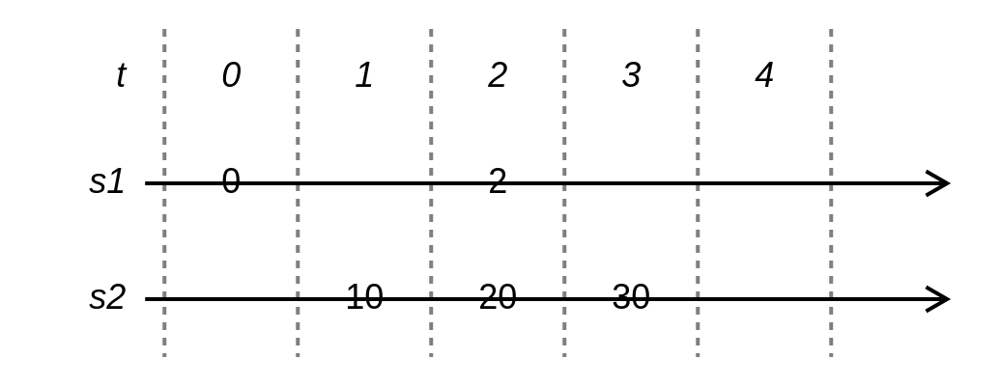

```
% Stream rows carry one slot per transaction, so the source lines up with the
% diagram. A value is typeset on the line rather than inside a marble, and a
% blank slot means the stream did not fire in that transaction.

@ t | 0 | 1 | 2 | 3 | 4

> s1 | 0 |    | 2  |    |    |

> s2 |   | 10 | 20 | 30 |    |
```

## gridSwitch

[Spec](examples/gridSwitch.txt)
·
[PNG](examples/gridSwitch.png)
·
[SVG](examples/gridSwitch.svg)

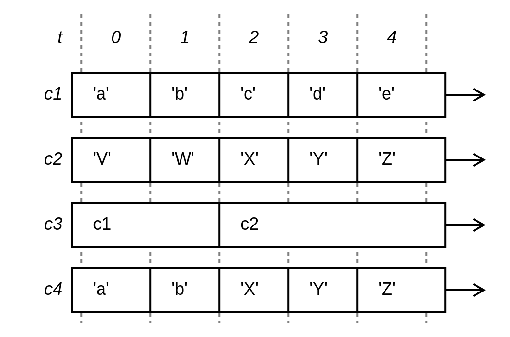

```
% `switch` — a cell whose value is another cell. A slot naming another row in
% the diagram resolves to a reference to that row rather than to a literal, so
% c3 holds c1 and then c2, and c4 is what the switched cell yields.

@ t | 0 | 1 | 2 | 3 | 4

= c1 | 'a' | 'b' | 'c' | 'd' | 'e' |

= c2 | 'V' | 'W' | 'X' | 'Y' | 'Z' |

= c3 | c1 |  | c2 |  |  |

= c4 | 'a' | 'b' | 'X' | 'Y' | 'Z' |
```

## onErrorResumeNext

[Spec](examples/onErrorResumeNext.txt)
·
[PNG](examples/onErrorResumeNext.png)
·
[SVG](examples/onErrorResumeNext.svg)

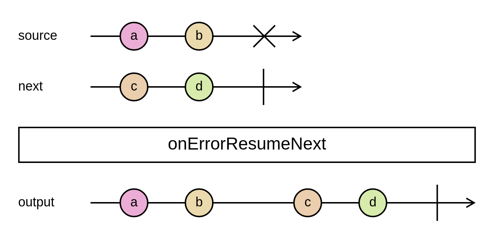

```
% An example application of the onErrorResumeNext operator.
% Showcases titles and error notifications.
% Based on RxJS's onErrorResumeNext diagram:
% https://github.com/ReactiveX/rxjs/blob/86dfe3c78dd37c6828a08b45364f030796879cc0/spec/operators/onErrorResumeNext-spec.ts

--a--b--#
title = source

--c--d--|
title = next

> onErrorResumeNext

--a--b----c--d--|
title = output
```

## pluck

[Spec](examples/pluck.txt)
·
[PNG](examples/pluck.png)
·
[SVG](examples/pluck.svg)

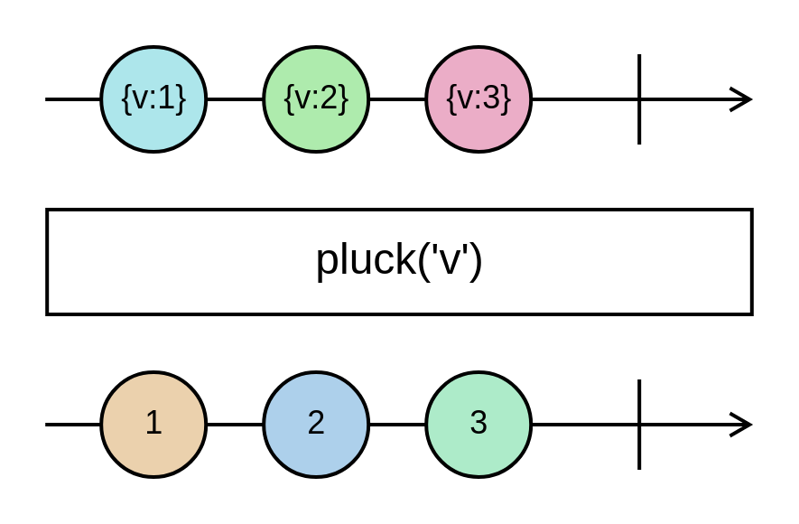

```
% An example application of the pluck operator.
% Showcases styles and notification values.
% Based on RxJS's pluck diagram:
% https://github.com/ReactiveX/rxjs/blob/fc3d4264395d88887cae1df2de1b931964f3e684/spec/operators/pluck-spec.ts

[styles]
event_radius = 30
operator_height = 60

--a--b--c--|
a := {v:1}
b := {v:2}
c := {v:3}

> pluck('v')

--x--y--z--|
x := 1
y := 2
z := 3
```

## skipUntil

[Spec](examples/skipUntil.txt)
·
[PNG](examples/skipUntil.png)
·
[SVG](examples/skipUntil.svg)

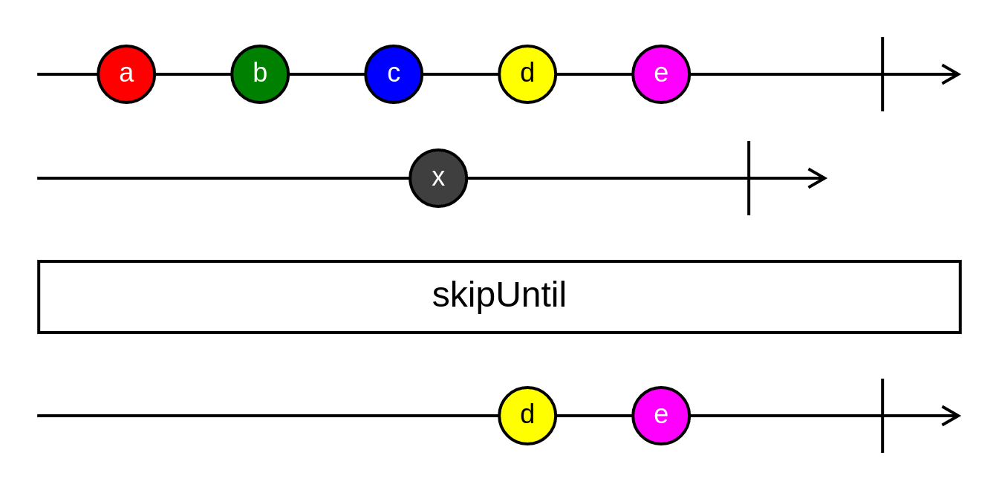

```
% An example application of the skipUntil operator.
% Showcases notification-level styling.
% Based on RxJS's skipUntil diagram:
% https://github.com/ReactiveX/rxjs/blob/fc3d4264395d88887cae1df2de1b931964f3e684/spec/operators/skipUntil-spec.ts

[styles]
event_value_color = white

[styles.a]
fill_color = #FF0000

[styles.b]
fill_color = green

[styles.c]
fill_color = rgb(0, 0, 255)

[styles.d]
fill_color = yellow
value_color = black

[styles.e]
fill_color = magenta

[styles.x]
fill_color = rgb(63, 63, 63)

--a--b--c--d--e----|

---------x------|

> skipUntil

-----------d--e----|
```

## zipAll

[Spec](examples/zipAll.txt)
·
[PNG](examples/zipAll.png)
·
[SVG](examples/zipAll.svg)

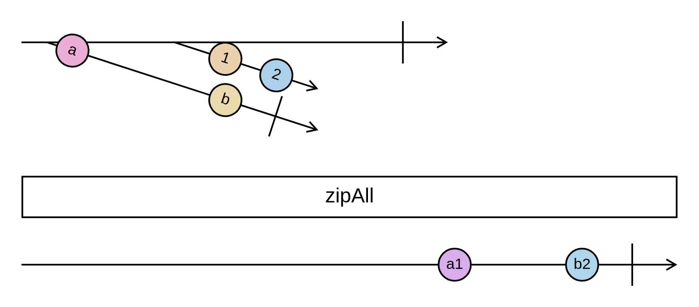

```
% An example application of the zipAll operator.
% Showcases higher-order observables and notification values.
% Based on RxJS's zipAll diagram:
% https://github.com/ReactiveX/rxjs/blob/fc3d4264395d88887cae1df2de1b931964f3e684/spec/operators/zipAll-spec.ts

x = -a-----b-|

y = --1-2-----

-x----y--------|

> zipAll

-----------------A----B-|
A := a1
B := b2
```

